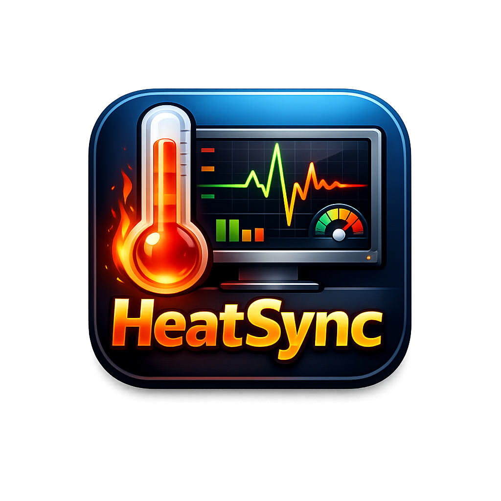
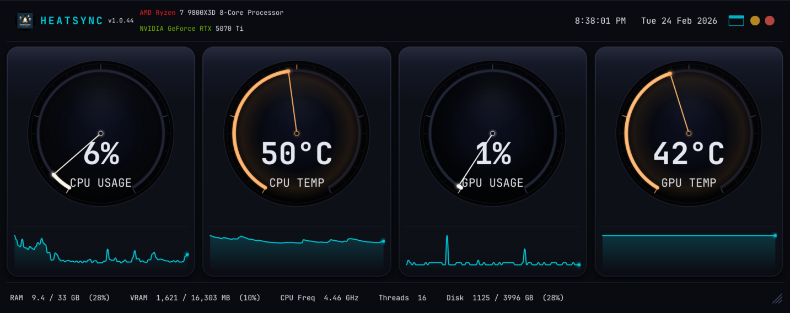
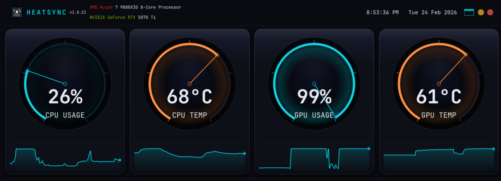
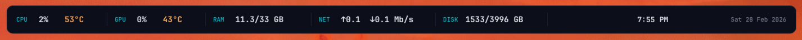

<p align="center">
  
</p>

<h1 align="center">HeatSync</h1>

<p align="center">
  Real-time system monitor for Linux, Windows, and macOS
</p>

<p align="center">
  
  <a href="https://gitlab.com/vibesmiths/HeatSync/-/releases"></a>
  <a href="https://aur.archlinux.org/packages/heatsync-bin"></a>
  
  
</p>

---







---

## Download

| Platform | Download | |
|---|---|---|
| **Linux** | [HeatSync.AppImage](https://gitlab.com/vibesmiths/HeatSync/-/releases) | Works on any distro |
| **Linux (Arch)** | `paru -S heatsync-bin` | AUR package |
| **Windows** | [HeatSync.exe](https://gitlab.com/vibesmiths/HeatSync/-/releases) | No install needed |
| **macOS** | [HeatSync.dmg](https://gitlab.com/vibesmiths/HeatSync/-/releases) | Drag to Applications |

---

## Features

### Gauges and Monitoring

- **Four main gauges** -- CPU usage, CPU temperature, GPU usage, GPU temperature with animated 300-degree arc sweep
- **Color-coded warnings** -- gauges shift from white to orange to red as values increase
- **Sparkline graphs** -- 90-point rolling history chart below each gauge
- **Per-core CPU usage** -- optional row showing individual core utilization
- **Fan RPM display** -- optional row showing system fan speeds
- **Network stats** -- optional panel showing upload/download speed in Mbps
- **Battery monitoring** -- optional gauge for laptops with low-battery warnings
- **NVMe/SSD temperatures** -- shows temps for up to 2 drives in the status bar
- **GPU power draw** -- wattage and percentage of power limit

### Status Bar

- RAM usage with memory type and speed (e.g., DDR5 @ 6000 MT/s)
- Swap usage
- VRAM usage
- CPU frequency and core count
- Disk usage (largest mount point)
- GPU core clock, memory clock, and power draw
- NVMe/SSD temperatures

### Compact Mode

A slim bar showing all key stats in minimal screen space:
- CPU usage + temp, GPU usage + temp
- RAM, network speeds, disk usage
- Live clock and date

### Display Options

- **Dock mode** -- double-click the title bar to snap to the top edge as a full-width bar
- **Lock to top** -- keeps the window pinned to the top edge (re-enforces position automatically)
- **Always on top** -- window stays above all other windows
- **Opacity control** -- adjustable window transparency (20-100%)
- **Window memory** -- remembers position, size, dock state, and mode between sessions

### System Tray

- Minimize to tray on close
- Tray icon changes color based on system load (normal/warn/danger)
- Show/hide toggle, always on top toggle
- Copy snapshot -- copies formatted system stats to clipboard with timestamp
- History window access

### History Window

- 3600-point rolling history charts for all metrics
- Accessible from title bar or tray menu
- Export history as PNG

### Data Export

- Optional CSV or NDJSON logging
- Configurable export path and retention (1-24 hours)
- Automatic flush every 60 seconds

### Alerts

- Per-metric temperature and usage thresholds
- Individual metric enable/disable
- Tray notifications with severity icons
- 5-minute cooldown between repeated alerts
- Triggers after 10 consecutive readings above threshold

### Profiles

- Save and load configuration presets
- Includes theme, gauges, opacity, refresh rate, and all settings
- Create, load, and delete profiles from the settings dialog

---

## Installation

### Linux

**AppImage** -- works on any distro (Ubuntu 18.04+, Fedora 32+, Arch, etc.):

```bash
chmod +x HeatSync.AppImage
./HeatSync.AppImage
```

**Arch Linux / AUR:**

```bash
paru -S heatsync-bin
```

**From source:**

```bash
git clone https://gitlab.com/vibesmiths/HeatSync.git
cd HeatSync
bash install.sh
```

`install.sh` creates a `.venv`, installs dependencies, and sets up autostart.

### Windows

Download **[HeatSync.exe](https://gitlab.com/vibesmiths/HeatSync/-/releases)** and run it -- no installation required.

> CPU temperature on Windows requires [LibreHardwareMonitor](https://github.com/LibreHardwareMonitor/LibreHardwareMonitor) running in the background.

### macOS

Download **[HeatSync.dmg](https://gitlab.com/vibesmiths/HeatSync/-/releases)**, open it, and drag HeatSync.app to your Applications folder.

---

## Themes

10 built-in themes. Switch from the settings menu in the title bar.

| Theme | Style |
|---|---|
| Dark | Default dark theme |
| Light | Clean light mode |
| Synthwave | Retro neon purple/pink |
| Midnight | Deep blue/black |
| Dracula | Classic Dracula palette |
| Nord | Arctic, north-bluish |
| Solarized | Solarized Dark |
| Forest | Earthy greens |
| Amber | Warm amber/orange |
| AMOLED | Pure black for OLED displays |

---

## Settings

The settings dialog has 7 tabs:

| Tab | Options |
|---|---|
| **Appearance** | Theme, compact mode, opacity |
| **Gauges** | Toggle CPU, GPU, network, battery, fan, per-core |
| **Display** | Monitor selection, refresh rate (0.5s - 10s) |
| **Startup** | Launch on login |
| **Data** | CSV/NDJSON export, path, retention |
| **Alerts** | Thresholds per metric, enable/disable |
| **Profiles** | Save/load/delete configuration presets |

---

## GPU Support

| GPU | Driver | Notes |
|-----|--------|-------|
| NVIDIA | pynvml | Requires `nvidia-utils` |
| AMD | amdgpu sysfs | No extra drivers |
| Intel Arc / iGPU | xe / i915 sysfs | No extra drivers |
| Windows (non-NVIDIA) | WMI | Basic stats via Windows Management |

When multiple GPUs are present, priority is NVIDIA then AMD then Intel.

---

## Verifying Downloads

All release artifacts are GPG-signed and include SHA256 checksums.

```bash
gpg --import heatsync-signing-key.asc
gpg --verify HeatSync.AppImage.asc HeatSync.AppImage
sha256sum -c SHA256SUMS
```

---

## Running Tests

```bash
source .venv/bin/activate
pytest tests/ -v
```

---

## License

[MIT](LICENSE)
